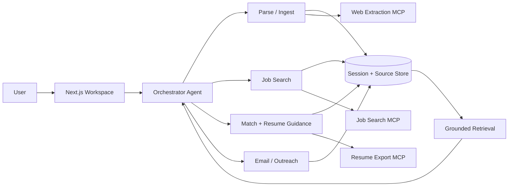

# CareerFlow AI

A grounded, local-first AI workspace for **job search, resume targeting, and career outreach**.

CareerFlow turns a resume, supporting documents, and job opportunities into a persistent workspace where users can search roles, compare fit, generate evidence-backed resume guidance, and draft outreach without mixing candidate facts with job-description claims.

## Highlights

- **Grounded career assistant** with separate candidate and opportunity corpora
- **Multi-step orchestration** for ingest, search, matching, resume guidance, and outreach
- **MCP integrations** for job search, resume export, and web extraction
- **Persistent sessions** with sources, chat history, artifacts, saved jobs, and workflow traces
- **Local-first storage** with optional provider adapters
- **Graceful fallbacks** so core workflows remain usable when optional MCP services are unavailable

## Architecture



The application keeps **candidate facts** and **opportunity facts** separate. Candidate claims are grounded in resume/supporting sources; role and company claims are grounded in saved opportunity sources.

For a deeper walkthrough, see [docs/architecture.md](docs/architecture.md).

## Core workflow

1. Upload or paste a resume and supporting material.
2. Parse the candidate profile and build a local source index.
3. Search for jobs or add a job description manually.
4. Save an opportunity into the session.
5. Run match analysis and generate resume improvement guidance.
6. Draft recruiter outreach, connection notes, or cover letters from grounded evidence.
7. Export a resume through an optional MCP adapter.

## Tech stack

- **Frontend / API:** Next.js 15, React 19, TypeScript
- **UI:** Tailwind CSS
- **Validation:** Zod
- **Storage:** local JSON by default, Firebase adapter boundary
- **Retrieval:** chunked source indexing with lexical fallback and optional embeddings
- **Model backend:** OpenAI-compatible inference API
- **Tool integration:** Model Context Protocol (MCP)
- **Optional planner:** CrewAI sidecar

## Quick start

### 1. Install

```bash
npm install
```

### 2. Configure

```bash
cp .env.example .env
```

Minimum configuration:

```env
FEATHERLESS_API_KEY=your_key_here
```

The default model/backend values in `.env.example` can be changed to another compatible endpoint.

### 3. Run

```bash
npm run dev
```

Open `http://localhost:3000`.

### 4. Try the sample workflow

Use **Load demo data** on the home page, then:

- review the seeded sources,
- search or select a role,
- save the opportunity,
- run match analysis,
- generate resume guidance or outreach.

## MCP integrations

MCP services are **optional external dependencies** and are not vendored into this repository.

Supported adapter boundaries include:

| Integration | Purpose |
| --- | --- |
| Job search MCP | Search and normalize job listings |
| Resume export MCP | Render a final resume artifact |
| Web extraction MCP | Extract structured content from URLs |

Configure them through `.env`. If an adapter is disabled or unavailable, CareerFlow falls back to local/manual behavior where supported.

Example:

```env
ENABLE_JOBSPY_MCP=false
ENABLE_RESUMAKE_MCP=false
ENABLE_DECODO_MCP=false
```

## Grounding design

CareerFlow maintains two evidence domains:

**Truth corpus**
- active resume
- supporting candidate documents
- candidate-provided notes

**Opportunity corpus**
- job descriptions
- saved job listings
- company / role pages

The retrieval layer preserves source metadata, and generated claims are expected to stay within the appropriate evidence domain. This prevents, for example, a requirement from a job description from being accidentally represented as a candidate skill.

## Main components

```text
app/
  api/                 Next.js API routes
  workspace/           primary application workspace

components/
  chat/                grounded chat UI
  sources/             source management
  actions/             workflow actions and trace
  workspace/           workspace shell

lib/
  agents/              orchestration and worker agents
  mcp/                 MCP client/adapters
  providers/           provider abstraction boundaries
  schemas/             typed application models
  storage/             local/Firebase storage interfaces
  tools/               parsing, retrieval, matching, export

crewai_bridge/          optional Python planner sidecar
data/sample/            demo seed data
docs/                   architecture notes
```

## API surface

Primary routes include:

- `POST /api/ingest`
- `POST /api/chat`
- `POST /api/jobs/search`
- `POST /api/jobs/save`
- `POST /api/match/run`
- `POST /api/email/run`
- `POST /api/export`
- `POST /api/sources/add`
- `POST /api/sources/replace-resume`
- `POST /api/sources/remove`
- `GET /api/session/[id]`
- `GET /api/sessions`

## Development

```bash
npm run typecheck
npm run build
```

A GitHub Actions workflow runs TypeScript checks on pushes and pull requests.

## Project status

CareerFlow began as a hackathon project and has since been reworked into a cleaner portfolio implementation with a simpler orchestration path, grounded retrieval, persistent sessions, and explicit MCP adapter boundaries.

Current limitations:

- local JSON is the default persistence mode;
- external job-search quality depends on the configured provider;
- autonomous planning through CrewAI is optional rather than required;
- this repository focuses on a reproducible local workflow rather than production-scale authentication or multi-tenant deployment.
