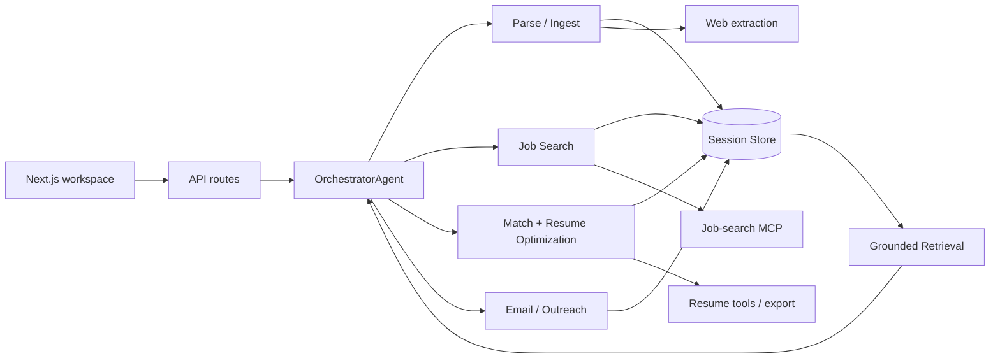

# Architecture

CareerFlow is organized around one rule: **keep orchestration, evidence, storage, and external tools separate**.

## Request path

## Canonical agent layer

The application now uses one orchestration path rather than maintaining parallel legacy supervisors.

- `orchestrator.ts` — intent routing and multi-step execution
- `parse-ingest.ts` — source ingestion and profile parsing
- `job-search.ts` — search, normalization, and saved opportunities
- `match-optimize.ts` — grounded fit analysis and resume guidance
- `email-connect.ts` — email, connection-message, and cover-letter drafting
- `shared.ts` — common context, artifacts, and workflow-trace helpers
- `crewai-bridge.ts` — optional planner bridge

Older supervisor/match/planner variants were removed so each responsibility has one implementation.

## Evidence model

CareerFlow separates two corpora:

### Truth corpus

Candidate-owned facts:

- resume;
- supporting candidate documents;
- user notes.

### Opportunity corpus

External role facts:

- job descriptions;
- saved job listings;
- company / role pages.

`lib/tools/retrieval.ts` is the single retrieval implementation. It can combine lexical scoring with optional embeddings while preserving source metadata.

This boundary prevents a job requirement from silently becoming a candidate claim.

## API surface

The public application path is intentionally small:

- `POST /api/ingest`
- `POST /api/chat`
- `POST /api/actions/run`
- `POST /api/jobs/search`
- `POST /api/jobs/save`
- `POST /api/sources/add`
- `POST /api/sources/update`
- `POST /api/sources/remove`
- `POST /api/sources/replace-resume`
- `POST /api/export`
- `POST /api/save-session`
- `GET /api/session/[id]`
- `PATCH /api/session/[id]`
- `DELETE /api/session/[id]`
- `GET /api/sessions`

Specialized legacy wrappers were removed in favor of `/api/actions/run`, which passes an explicit action to the orchestrator.

## Storage

Each session can persist:

- source manifest;
- active resume;
- saved opportunity sources;
- parsed candidate profile;
- selected opportunity profile;
- search results;
- match reports;
- messages;
- artifacts;
- workflow trace.

The storage interface remains abstract so the local JSON backend can be swapped without changing agent logic.

## MCP boundary

External services are isolated under `lib/mcp/`. Core workflows do not assume that every MCP service is available. Adapters expose configuration checks and allow local/manual fallback where the application supports it.

## Optional planner

The CrewAI bridge is separate from the default orchestration path. When enabled, it can suggest intent sequences; the Next.js application remains the execution host and system of record.
